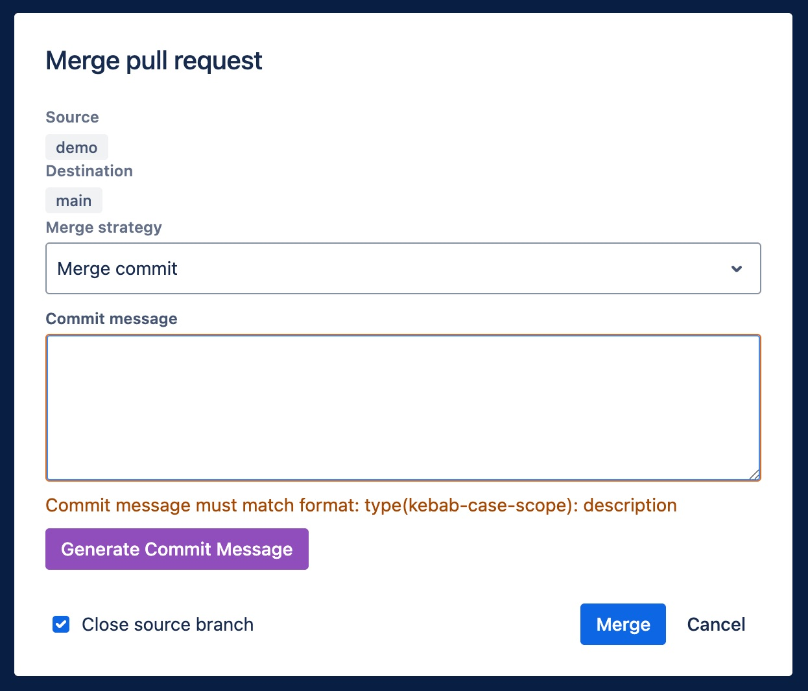

# Bitbucket Conventional Commits

A browser extension that adds conventional commit linting and AI-powered commit message generation directly to the Bitbucket merge modal. This tool helps ensure that your commit messages are consistent and properly formatted while saving you time by automatically generating suggestions based on the changes made in your pull request.

## Key Features

- **Commit Message Linting** – Automatically validates your commit messages to ensure they follow the conventional commit standards.
- **AI-powered Commit Message Generation** – Generates or suggests commit messages based on the changes made in your pull request, saving you time and ensuring accuracy.
- **Bitbucket Integration** – Seamlessly integrates into the Bitbucket merge modal, allowing you to validate and generate commit messages within the same interface.

## Get the Extension

- [Chrome Web Store](https://chromewebstore.google.com/detail/bitbucket-conventional-co/hldhjbpmeomlaienhkdkcmlfnglhahih)
- [Firefox Add-ons](https://addons.mozilla.org/en-US/firefox/addon/bitbucket-conventional-commits/)
- Edge Coming Soon

---

_This extension is not affiliated with or endorsed by Bitbucket._
